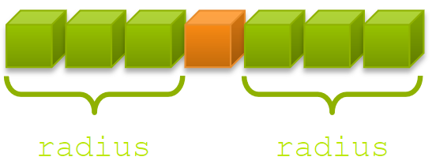
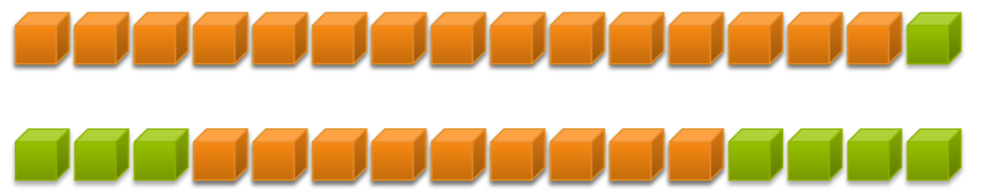
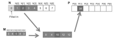
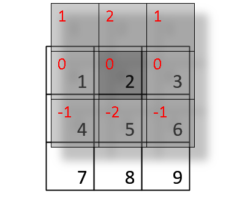
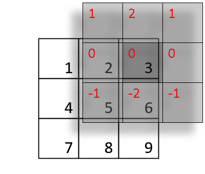
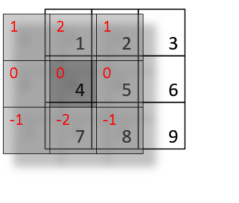
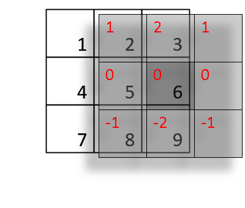
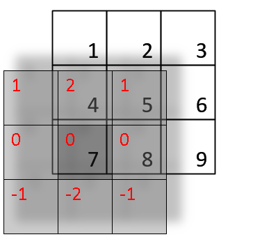
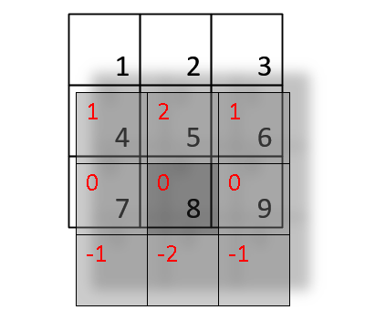

# Laboratory 03

Using the shared and constant memory of the GPU

## Exercise 1: 1-D Stencil

Consider applying a 1D stencil to a 1D array of elements. Each output element is the sum of input elements within a radius. So, if the radius is 3, then each output element is the sum of 7 input elements:



A GPU can implement a stencil operation by making every thread process one output element. So, in the following graphical example, each input element is read seven times when using a stencil of radius 3.



Such data reuse can harness the shared memory of the GPU.

Your first task is to create a 1D stencil application that uses shared memory. The code skeleton is provided in stencil_1d.cu. Edit that file, paying attention to the FIXME locations. The code will verify the output and report any errors.

After editing the code, compile it using the following:

```bash
nvcc -arch=sm_{xx} -o stencil_1d stencil_1d.cu # xx is your GPU compute capability
```

## Exercise 2: 2D Matrix Multiply Using Shared Memory

Now apply shared memory to the 2D matrix multiply. FIXME locations are provided in the code skeleton in matrix_mul_shared.cu – available in the zip file attached to this guide lab03.zip. See if you can successfully load the required data into shared memory and then appropriately update the dot product calculation. Compile and run your code using the following:

```bash
nvcc -arch=sm_{xx} -o matrix_mul matrix_mul_shared.cu # xx is your GPU compute capability
./matrix_mul
```

## Exercise 3: 1-D Convolution

Consider a scheme of a simple 1D convolution. Convolution is an array operation where each output data element is a weighted sum of a collection of neighboring input elements. The weights used in the weighted sum calculation are defined by an input mask array.

$P[i] = \sum_{j=-n}^{+n}N[i+j]\times M[j+n]$




**k** is the width of the filter **M**, **n** is floor(k/2). **w** is the width of the input **N**. Non-existing cells (e.g., N[x] when x < 0 or x >= w) are considered to have a default value of 0.


**Assignment 1:**

Write the code to perform the following:

- allocate device memory
- copy host memory to the device
- initialize thread block and kernel grid dimensions
- invoke CUDA kernel performing convolution
- copy results from the device to the host
- deallocate device memory

Each thread computes a value of P.

Evaluate performance (global memory r/w, execution time…) and compare CPU (to be coded) and GPU solutions. (use parametric values for k and w)

**Assignment 2:**

Improve your solution using:

- Constant memory
- Shared Memory (Tiling approach)
Evaluate the improvement due to each of them (and both)

## Exercise 4: Optimization of 2-D convolution

Similarly to the 1-D convolution, the 2-D convolution takes an small matrix, called kernel, and computes a dot product across the target matrix.

The following equation describes a 2D convolution

$y[m,n]=x[m,n]*h[m,n] = \sum_{j=-\infty}^{\infty}\sum_{i=-\infty}^{\infty}x[i,j] \cdot h[m-i, n-j]$

Here is a simple example of convolution of 3x3 input signal and impulse response (kernel) in 2D spatial.

|||
|:-:|:-:|
||$y[0,0]=\sum_{j=-1}^{1}\sum_{i=-1}^{1}x[i,j] \cdot h[0-i, 0-j]$|
||$y[1,0]=\sum_{j=-1}^{1}\sum_{i=0}^{2}x[i,j] \cdot h[1-i, 0-j]$|
||$y[2,0]=\sum_{j=-1}^{1}\sum_{i=1}^{3}x[i,j] \cdot h[2-i, 0-j]$|
||$y[0,1]=\sum_{j=0}^{2}\sum_{i=-1}^{1}x[i,j] \cdot h[0-i, 1-j]$|
||$y[1,1]=\sum_{j=0}^{2}\sum_{i=0}^{2}x[i,j] \cdot h[1-i, 1-j]$|
||$y[2,1]=\sum_{j=0}^{2}\sum_{i=1}^{3}x[i,j] \cdot h[2-i, 1-j]$|
||$y[0,2]=\sum_{j=1}^{3}\sum_{i=-1}^{1}x[i,j] \cdot h[0-i, 2-j]$|
||$y[1,2]=\sum_{j=1}^{3}\sum_{i=0}^{2}x[i,j] \cdot h[1-i, 2-j]$|
||$y[2,2]=\sum_{j=1}^{3}\sum_{i=1}^{3}x[i,j] \cdot h[2-i, 2-j]$|

Implement your algorihtm in CUDA to compute the 2-D convolution of an imput matrix of $400 \times 400$ and a $3 \times 3$ kernel. Make your implementation w/ and w/o constant memory and Shared Memory (Tiling approach)

Evaluate the improvement due to each of them (and both).
