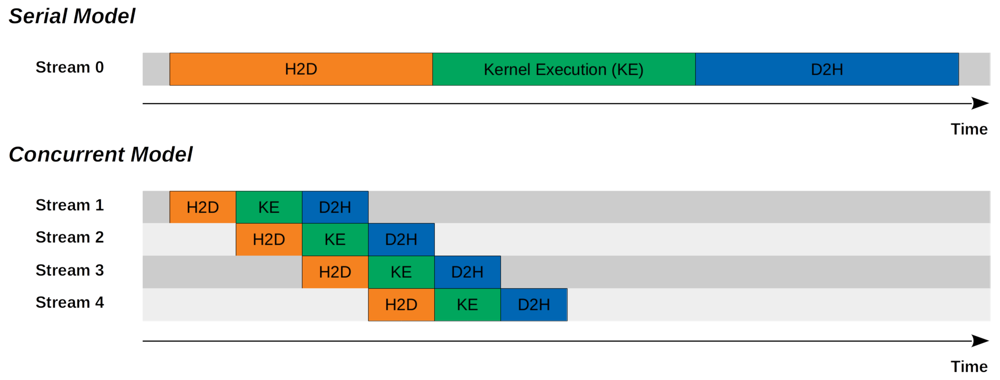

# Laboratory 04

Events and Streams in CUDA

## Introduction

The Kernel Execution (**KE**) in a GPU has two additional steps. These two steps are memory copy from Host to Device (**H2D**) and from Device to Host (**D2H**). Intuitively, we would copy the input memory from the host to the device first, then execute the kernel to compute the output, and finally copy the output memory from the device back to the host. However, this serial approach might not be optimal because we may further improve the performance by doing memory copy from host to device, kernel executions, and memory copy from device to host concurrently. To do this, there is an interesting concept named “streams”. This particular execution model comprises the following facts or assumptions:

- The memory copy (**H2D**, **D2H**) time is linearly dependent on the size of the memory for copy.
- The GPU would never be fully utilized.
- The kernel execution **KE** could be divided into $N$ smaller kernel executions, and each smaller kernel execution would only take $1/N$ of the time the original kernel execution takes.
- The memory copy time from host to device, kernel execution, and memory copy time from device to host are the same.
- Each CUDA engine executes commands or kernels in order.

Consequently, we could come up with two models to implement the program: *i)* the serial model and *ii)* the concurrent model.

||
|-|
||
|**CUDA Stream:** Serial Model vs Concurrent Model|


## Exercise 1: CUDA Streams

For your first task, you are given a code that performs a silly computation element-wise on a vector `overlap.cu`. You can initially compile, run and profile the code if you wish.

compile it using the following:

```bash
    nvcc -arch=sm_{xx} -o overlap overlap.cu -lcudart # xx corresponds to your GOU compute capability 
```

Your objective is to create a fully overlapped version of the code. Use your knowledge of streams to create a version of the code that will issue the work in chunks, and for each chunk perform the copy to device, kernel launch, and copy to host in a single stream, then modifying the stream for the next chunk. The work has been started for you in the section of code after the #ifdef statement. Look for the ``FIXME`` tokens there, and replace each ``FIXME`` with appropriate code to complete this task.

When you have something ready to test, compile with this additional switch:

```bash
nvcc -arch=sm_{xx} -o overlap overlap.cu -DUSE_STREAMS -lcudart # xx corresponds to your GOU compute capability 
```

if you run the code, there will be a verification check performed, to make sure you have processed the entire vector correctly, in chunks. If you pass the verification test, the program will display the elapsed time of the streamed version. You should be able to get to at least 2X faster (i.e. half the duration) of the non-streamed version.

## Exercise 2: CUDA Events

1. Consider the following kernel

    ```cpp
    __global__  void trigonometric_kernel(float* a, float* b, unsigned int offset){
        unsigned int i = offset + threadIdx.x + blockIdx.x * blockDim.x; 
        float x, s, c;
        x = (float)i; 
        s = sinf(x); 
        c = cosf(x);
        a[i] = b[i] + sqrtf(s * s + c * c);
    }
    ```

2. Write a program to call the kernel on vectors of different length. Modify the kernel if needed.

3. Familiarize yourself with CUDA documentation to understand the following code snippets, which use events to calculate elapsed time: <<https://docs.nvidia.com/cuda/cuda-runtime-api/group__CUDART__EVENT.html>

    ```cpp
    // Initialize Events 
    cudaEvent_t start, stop; 
    cudaEventCreate(&start); 
    cudaEventCreate(&stop);

    // Record start event 
    cudaEventRecord(start, 0);

    // Memory Transfer
    // Kernel Call
    // Memory Transfer

    // Record stop event 
    cudaEventRecord(stop, 0); cudaEventSynchronize(stop);

    // Calculate elapsed time 
    float elapsedTime;
    cudaEventElapsedTime(&elapsedTime, start, stop);
    ```

4. Write code to measure the execution time of the kernel using events. Experiment with different grid sizes and make considerations on the resulting execution times. Adjust the vector lengths and grid sizes based on your experimentation needs.

## Exercise 3: Streams and CUDA events

1. Using Streams for implementing a solution to exercise 2. Implement CUDA streams to parallelize the execution of multiple kernels. Use streams to assign different chunks of work to each stream.

2. Measure the execution time and compare it with the non-streamed version from Exercise 2.

3. Experiment with varying the number of streams and the size of the grid, testing different combinations of grid size and stream number to observe their impact on execution time.

4. Discuss your Findings.

## Additional Notes

- Refer to the CUDA Runtime API documentation on Streams. <https://docs.nvidia.com/cuda/cuda-runtime-api/group__CUDART__STREAM.html>

- Pay attention to how overlap computation and data transfer is crucial for achieving performance improvements.

- Experiment with asynchronous execution of streams to maximize GPU utilization.
