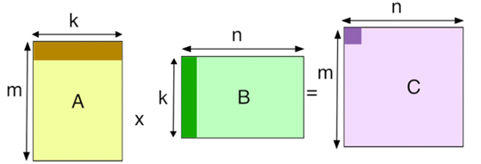

# Laboratory 05

**Goals:**

- To acquire confidence in the development of parallel programs for GPUs by exploiting the main benefits of parallel threading;
- To analyze the management of parallel threads in case of conditional statements and iterative operations;
- To practice the development of parallel applications using the CUDA programming environment for the Jetson Nano GPU platform.

## Preliminary tutorial

The threading in GPUs is based on the organization and handling of threads (and warps) to execute a given operation. In the most ideal of the cases, the implementation or description of a parallel algorithm targets the highest performance by using as many parallel threads as possible, so achieving a high percentage of embarrassingly parallel operation in the complete program.

Unfortunately, the complexity in most algorithms demands clever thread management involving the addition of conditional statements (e.g., `if` and switch `case`) and iterative operators (e.g., `for` and `while`) in some regions of the program. The conditional statements are used to select operative conditions based on local threads parameters (e.g., `ThreadId.x`), shared resources (i.e., a shared variable among threads) or general conditions of the program. It is worth noting that conditional statements may cause intra-warp divergence (when threads in a warp execute different instructions and operations according to a selected path). Moreover, the iterative statements are used in combination with local variables in a thread to perform extended operations per thread (e.g. multidimensional accumulations).

## Exercise 1

One example of parallel application is the scalar operations between two vectors of the same size A and B. An optimal implementation of the application uses each thread to process an independent portion of the operation (ai + bi). Moreover, it is also possible to configure the threads to perform several operations by adding `if` and `for` statements.

In the jetson platform, the sample code is found in:  `/usr/local/cuda/samples/0_Simple/vectorAdd`

```cpp
/*Listing 1.Three implementations of a Vector_add algorithm.*/
/*Kernel1*/
__global__ void Vector_add(int* a, int* b, int* c){
    int tid = threadIdx.x + (blockDim.x * blockIdx.x);
    c[tid] = a[tid] + b[tid];
}

/*Kernel2*/
__global__ void Vector_add(int* a, int* b, int* c){
    int tid = threadIdx.x + (blockDim.x * blockIdx.x);
    if(tid%2 == 0){
        c[tid]= a[tid] + b[tid];
        c[tid+1]= a[tid+1] + b[tid+1];
    }
}

/*Kernel3*/
__global__ void Vector_add(int* a, int* b, int* c)
{
    int tid = threadIdx.x + (blockDim.x * blockIdx.x);
    if(tid%4 == 0){
        for(int i = 0;i <4; i = i+1)
        {
            c[tid+i]= a[tid+i] + b[tid+i];
        }
    }
    }
```

1. Explain the main features in the thread execution of the three different descriptions of the parallel vector add program.
    - Is there a limitation in terms of possible size of the input vectors?
    - How many operations are assigned to each thread?
    - Is there any possible intra-warp divergence on each program?. If yes, please, identify the total number of active threads per warp.

2. adapt the code from ‘kernel 2’ to describe a program to perform the following operations according to the value of an input argument ‘op_type’:
    - op_type  = 1:  Vector addition (only executed by the even threads in a warp).
    - op_type  = 2:  Vector substraction (only executed by the odd threads in a warp).
    - op_type  = 3:  SAXPY (executed by either the even or odd threads in a warp).

    The SAXPY application is described by the equation:

    $C=\alpha A+B$

    where, $\alpha$  is a scalar value, and A, B and C are one-dimension arrays.

    **Hint:** use the conditional statements (`if` and `switch case`) to describe the selection of the operation to be executed inside the kernel.

    Are the conditional statements causing intra-warp divergence? why?

3. adapt the code of ‘kernel1’ to calculate the scalar product (or dot product) of two input vectors A and B with the same size, following the equation:

    $c = (\alpha \cdot A) \cdot (\beta \cdot B)$

    where, $\alpha$, $\beta$, and $c$ are scalar values.

## Exercise 2

Consider the description of a naive parallel matrix multiplication based on the following equation:

$C_{(i,j)}=\sum_{k=0}^{w-1}a_{(i,k)}b_{(k,j)}$

In this case, each element of the output matrix C, is determined as the accumulative product (dot product) of elements a and  b from the input matrices A and B, respectively, as depicted by Figure 1.

||
|-|
|Figure 1. A general scheme of the naive matrix multiplication. |
||
||

A simplified kernel implementation of the matrix multiplication for matrices with the same size is presented in listing 2.

```cpp
/*Listing 2. Naive matrix multiplication kernel.*/
__global__ void naive_matrix(int* input_a, int* input_b, int* output_c, int limit)
{
    int col = blockIdx.x * blockDim.x + threadIdx.x;
    int row = blockIdx.y * blockDim.y + threadIdx.y;
    int i = 0;
    if (row < limit && col < limit){
        for (i = 0; i < limit; ++i){
            output_c[row * limit + col] += input_a[row * limit + i] * input_b[i * limit + col];
        }
    }
}
```

From the kernel, please, observe that thread parameters in two dimensions (`threadId.x` and `threadId.y`) are used to the take advantage of the spatial parallelism. Thus, both thread parameters are organized to address the rows and columns of the input matrices (input_a, and input_b). In detail, the values in the matrices are address using a local variable (i), which serves as memory-offset to address each element from both matrices. The iterative loop is employed to determine the accumulative operation as described by the equation.

It is worth noting that elements from both matrices, A and B, are organized in row-major order inside the device memory. The argument “limit” indicates the width of both matrices. Finally, the conditional statement determines the number of active threads according to the sizes of the input matrices.

1. Is it possible to eliminate the `if` conditional statement (line 6 in listing 2)?, does the removal affect the results?, which are the implications?

2. Modify the description of the kernel to operate the matrix multiplication of input matrices A and B with different sizes, as depicted in Figure 1.

3. Adapt the code in listing 2 to implement a bounded matrix transpose of an input matrix A with real values (``float``), described as:

    $a_{(j,i)}^T=a_{(i,j)}$, when the value a   is lower than 10.5 and higher than 0

    $a_{(j,i)}^T=10.5$, when the value a   is higher or equal to 10.5

    $a_{(j,i)}^T=0$, when the value a   is higher than -10,5 and lower than 0

    $a_{(j,i)}^T=a_{(j,i)}+1,25$, when the value a   is lower or equal than -10,5


    **Hint:** use the conditional statements (`if` and `switch case`) to describe the selection of the operation to be executed inside the kernel.

    Is it possible to generate intra-warp divergence when implementing the kernel?, why?

## Exercise 3

Describe a parallel kernel implementing a simplified version of a two-dimension median filter.

In this case, consider an n-by-n input matrix with integer elements. The median filter considers each element in the matrix and looks at its nearby neighbors to decide whether or not it is representative of its surroundings. Thus, instead of simply replacing an output element value with the mean of neighboring element values, the median replaces the output element with the median of those values.

The median is calculated in two steps: **1)** first, the element values are sorted from the surrounding neighborhood into numerical order. **2)** Then, the output element (being considered) is replaced with the middle element value. It must be noted that when the neighborhood under consideration contains an even number of elements, the average of the two middle elements values is used. Figure 1 depicts an example of the calculation. The following link provides further details about the median filter: <https://www.youtube.com/watch?v=TYNbTdzm-5w>.

||
|-|
|Figure 2. Illustration of the calculation of the median of the neighborhood element 150 in the input matrix.|

|||
|-|-|
||Output median of the element “with value **150”** in the matrix Neighbourhood values (after sorting) are: **115, 119, 120, 123, 124, 125, 126, 127, 150** Median value: **124**|
|||

1. describe in CUDA a parallel kernel to perform the median filter (3X3) of an input matrix of 32x32 (n=32). Initially, consider the edged of the output median as zero.

    **Hints:**
    - Use as many threads as possible to describe the algorithm;
    - Consider that each thread must process the median operation using the values from the input matrix and the neighbors of each element;
    - Employ a mechanism to sort the values per thread (e.g., one or more`if`statements);
    - Employ a mechanism to determine the median value.
    - Implement the median filter algorithm using tiling and shared memory
        - register the differences in term of execution time
        - change the kernel configuration parameters i.e., threads per block.

2. Extend the description of the median filter to input matrices of 1024x1024 (n=1024) or any other high dimentional size such as HD, 4K, etc. Calculate the median also in the corner cases (limits 0, and 1023) of the output matrix.

    **Hint:**
    - Consider using the shared memory capabilities to divide the median operation in blocks and process the complete input matrix in parallel.
    - Include one or more conditional statements to handle the median in the corner cases.

3. (optional) Adapt the kernel description to process the pixels of one layer from an input image.
    **Hint:** use the OpenCV library to load images from files and split the layers. Altenatively you can use the helper libraries provided to you in [Lab02](../Lab02/).

The following is an example of median filter applied an RGB color image that contained Salt & Pepper noise corruption:

