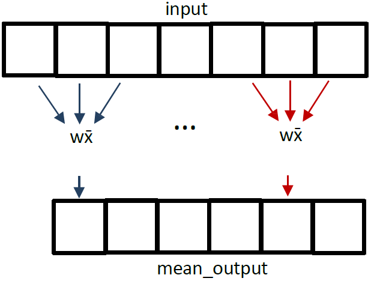
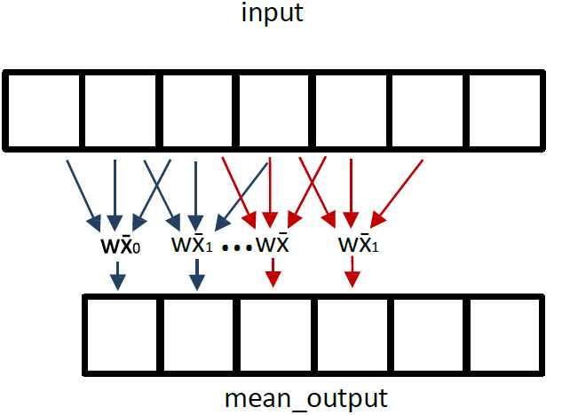

# Laboratory 05

Profiling GPU workloads

**Goals:**

- To acquire confidence in the development and analysis of parallel programs for GPUs
- To analyze the performance effect of different workloads and levels of parallelism in GPU programs
- To practice with the profiler utilities in the Jetson Nano GPU platform

## Exercise 1: profiling, preliminary tutorial

Listing 1 describes a naïve implementation of a parallel algorithm to sort elements inside a vector using two input arguments (data and num_elem). The first argument allows addressing the input vector for sorting and also stores the outputs, while the second argument defines the limit number of elements to be sorted by the parallel program.
Each thread in the program evaluates a set of two consecutive elements in the vector and organizes them according to their magnitude. An offset is employed to select an even or odd set of elements for the evaluation. This sorting procedure is repeated the number of times defined by the second input argument.

```cpp
    /*Listing 1*/
    __global__  void parallel_sort(int *data, int num_elem){
    unsigned int tid = (blockIdx.x * blockDim.x) + threadIdx.x;
    unsigned int tid_idx;
    unsigned int offset = 0;
    unsigned int d0, d1;
    unsigned int tid_idx_max = (num_elem - 1);
    for (int i = 0; i < num_elem; i++){
        tid_idx = (tid * 2) + offset;
        if (tid_idx < tid_idx_max){
            d0 = data[tid_idx];
            d1 = data[tid_idx + 1];
            if (d0 > d1){
                data[tid_idx] = d1;
                data[tid_idx + 1] = d0;
            }
        }
        if (offset == 0)
            offset = 1;
        else
            offset = 0;
    }
 }

```

*Profiling steps:*

1. Describe the Host code to employ the parallel_sort kernel and verify the operation with an input vector of 256 elements organized as 2 blocks of 128 threads

    - **Hint:** use the same procedures from previous lab exercises to describe the host code.

    - According to the description in listing 1, is it possible to affirm that the sorting algorithm is a fully embarrassingly parallel kernel? Why?

    - Is it possible to affirm that all threads in the parallel_sort kernel would execute the same instructions? Are all threads active during the execution of the kernel? Why?

2. Use the profiling tool (nvprof) to determine the execution time of the parallel_sort kernel.
    - Hint: from command line, use: `nvprof ./your_app.out` to observe the summary mode of the parallel program. In this mode, nvprof outputs a single result line for each kernel and each type of CUDA memory copy/set performed by the application. For each kernel, nvprof outputs the total time of all instances of the kernel and memory movements.
    - According to the profiler output, is the execution time the same for the kernel after every running? Where is the main bottleneck for the parallel application under the selected configuration?

    **NOTE**: in Jetson Nano platform, nvprof may have no system privileges, so use administrator privileges (sudo su) or a make file to perform the profiling of an application.

3. Determine the number of registers per thread, the static shared memory used per block, and the dynamic shared memory used per block using the (nvprof) tool.

    **Hint**: from command line, use: `nvprof --print-gpu-trace ./your_app.out` to observe the running kernel, as well as the grid dimensions used for each launch. Moreover, the report also includes the registers and shared memory occupancy and the duration of each kernel.

    **NOTE**: try and analyze the effect of `nvprof --print-api-trace ./your_app.out`

4. Analyze the effect in performance for the kernel and the memory copy operations when the workload varies from 32
to 2048 elements in the vector to be sorted. For this purpose, determine the relationship between the execution time vs. the number of elements to process by the kernel.

    **Hint**: Perform the code changes to use the kernel and sort different size elements in the vector: 32, 64, 128, 256, 512, 1024, 2048. Then, use the profiler to calculate the execution time of each kernel.

    - Are the parallel algorithm and the compilation correctly working for a vector with 2048 elements?

    - Please use the documentation of Jetson Nano to understand the behavior for a configuration with 2048 elements. Then, adopt the kernel parameters to sort a vector with 2048 elements.

5. Determine the parallel metric traces for the application configured to sort 1024 elements in a vector. Analyze the
number of IPCs (Instructions per cycle), the number of integer instructions, number of floating-point operations (single precision), number of control-flow instructions, number of load/store instructions, and number of instructions per warp.

    **Hint**: use `nvprof –metrics all --log-file your_file.log ./your_app.out`

    - Is the number of integer and floating-point instructions from the traces somehow related? Why?

6. Determine the parallel event traces for the sorting application and analyze the number of warps launched by the kernel, the number of unconditional instructions executed per thread (not predicated), and the number of CTAs launched per SM. For this purpose, evaluate the parallel configurations:
    - 1 block-per-grid and 1024 threads-per-block
    - 2 blocks-per-grid and 512 threads-per-block

    **Hint**: use `nvprof –events all --log-file your_file.log ./your_app.out`

    After running both kernels with the different configurations, are the output results equal? Why? Is there any relation between the CTAs and the blocks-per-grid?

### Profiling in modern GPUs

In modern GPUs like ampere (i.e., cc>80) the `nvprof` profiler is not supported anymore. Instead, it is necesary to use the nvidia nsight-compute tools.

It's necessary to complete task 1 first, compiling your cuda program as usual. Then, launch Nsight as follows: (you may want to make your terminal session wide enough to make the output easy to read)

```bash
nv-nsight-cu-cli ./your_app
```

What does the output tell you? Can you locate the lines that identify the kernel durations? Are the kernel durations the same or different? Would you expect them to be the same or different?

Next, launch Nsight as follows:

```bash
nv-nsight-cu-cli --metrics l1tex__t_sectors_pipe_lsu_mem_global_op_ld.sum,l1tex__t_requests_pipe_lsu_mem_global_op_ld.sum ./your_app
```

One goal could be to measure the global memory load efficiency of our kernels. In this case we asked for two metrics: "l1tex__t_requests_pipe_lsu_mem_global_op_ld.sum" (the number of global memory load requests) and "l1tex__t_sectors_pipe_lsu_mem_global_op_ld.sum" (the number of sectors requested for global loads). This first metric above represents the denominator (requests) of the desired measurement (transactions per request) and the second metric represents the numerator (transactions). Dividing these numbers will give us the number of transactions per request.

What similarities or differences do you notice between the row_sum and column_sum kernels? Do the kernels (row_sum, column_sum) have the same or different efficiencies? Why? How does this correspond to the observed kernel execution times for the first profiling run?

Here is a useful blog to help you get familiar with Nsight Compute: <https://devblogs.nvidia.com/using-nsight-compute-to-inspect-your-kernels/>

## Exercise 2

From results of the Exercise 1, Step 4, or by the results of the `nv-nsight-cu-cli` depict the operating points using a performance roofline model.

## Exercise 3

The degree of parallelism can also impact the performance and resource usage of a parallel application. To observe and evaluate the effect of different levels of parallelism:

1) Design two parallel programs (kernels) to calculate the local mean (mean among three consecutive elements of a vector) using the two approaches as depicted in the following figure.
In the first approach, the kernel performs one operation and store the result in a new vector (mean_output). In the second approach, the kernel performs two consecutive operations and stores the two results in a new vector (mean_output).
Hint: Use the following template to define each kernel:

    ```cpp
        __global__ void weight_mean_XXX(float *input, float *mean_output, int total_elements){
        …
        }
    ```

    | | |
    |:-:|:-:|
    |Approach 1| Approach 2|
    || |
    |||
    
    $\bar{X}=\frac{3.25 \times a_0 + 0.95 \times a_1 + 1.29 \times a_2}{3.2}$ where $a_0$, $a_1$, $a_2$ are consecutive elements from the imput vector

2) Configure and verify the operation of both kernels to operate with an input vector of a) 1,256, b) 12,756, and c)
25,420 elements.

3) Determine the performance, IPC, and the number of registers used per thread for both kernels.

4) Determine and compare the number of integer, floating-point, and control-flow instructions for both kernels.

5) Calculate the dependency analysis for both kernels and analyze the main cause of latency (waiting time).

    **Hint**: use the option --dependency-analysis in nvprof tool.

6) depict the operating points of both kernels using a performance roofline model.

